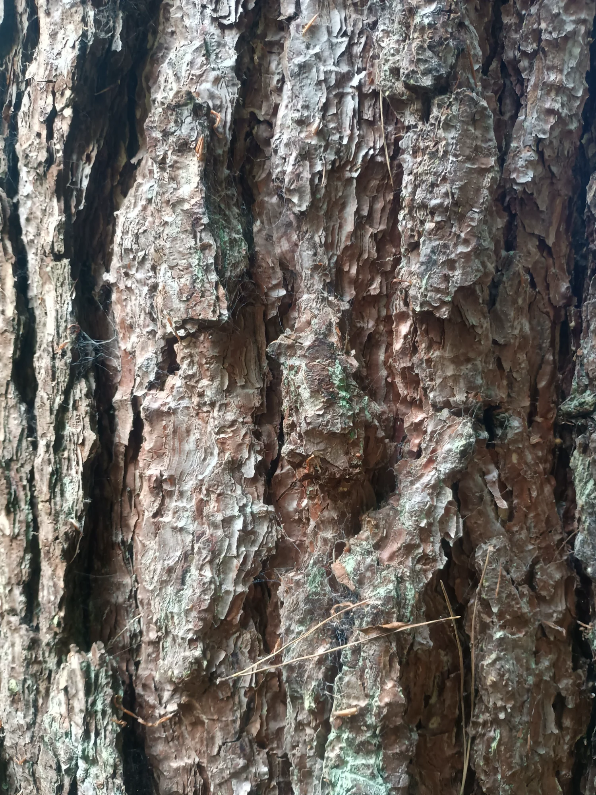

# SpyGlass

**Image-to-Sound Synthesis using Visual Analysis**

SpyGlass is a Max/MSP project that translates visual information into sonic parameters through a movable "spyglass" window that analyzes regions of an image and drives sound synthesis engines.



## Concept

The spyglass metaphor allows you to "scan" across an image, extracting visual data (brightness, texture, edges) from a controllable window. This data then drives various sound generation engines, creating a direct link between visual and sonic domains.

Think of it as using an image as a dynamic score, where different regions produce different sonic behaviors based on their visual properties.

## Current Features

- ✓ **Modular Sound Engine Architecture** - Swap between different synthesis approaches
- ✓ **Image Analysis** - Brightness, edge detection, and statistical analysis
- ✓ **Geiger Counter Engine** - Crackling, randomized click generation
- ✓ **Parameter Control** - 7 continuous parameters + enable/disable
- ✓ **Audio Monitoring** - Level meters and gain control
- ✓ **Dynamic Engine Loading** - Runtime engine switching

## System Requirements

- Max/MSP 9.0 or later
- macOS or Windows
- Recommended: MIDI controller or OSC device for external control

## Project Structure

```
SpyGlass/
├── 00_parent.maxpat              # Main control interface
├── noise.engine~.maxpat          # Engine container/router
├── eng.geiger~.maxpat            # Geiger counter sound engine
├── eng.null~.maxpat              # Silent/bypass engine
├── voice~.maxpat                 # Audio voice generator
├── env~.maxpat                   # Envelope generator
├── events.maxpat                 # Trigger generation system
├── image.spyglass.maxpat         # Image analyzer (v1)
├── image.spyglass.v3.maxpat      # Image analyzer (latest)
├── images/
│   └── tree_bark.jpg             # Test image
└── docs/
    ├── COMPONENT_REFERENCE.md    # Detailed component documentation
    ├── QUICKSTART.md             # Getting started guide
    └── DATAFLOW.md               # Signal flow diagrams
```

## Quick Start

1. **Open the main patch:**
   ```
   Open: 00_parent.maxpat
   ```

2. **Turn on audio:**
   - Click the speaker icon on ezdac~

3. **Enable the system:**
   - Toggle the "Enable" switch ON

4. **Adjust parameters:**
   - Intensity: Controls click density
   - Pitch: Pitch/frequency control
   - Random: Randomization amount
   - X/Y: Position controls
   - Size: Window size control

5. **Try different engines:**
   - Click `eng.geiger~.maxpat` for clicks
   - Click `eng.null~.maxpat` for silence

## Parameters

| Parameter | Range | Description |
|-----------|-------|-------------|
| Enable | 0/1 | Master on/off switch |
| Pitch | 0-1 | Pitch/frequency control |
| Random | 0-1 | Randomization amount |
| X | 0-1 | Horizontal position |
| Y | 0-1 | Vertical position |
| Size | 0-1 | Window/analysis size |
| Intensity | 0-1 | Density/amplitude |

## Architecture

```
Image Analysis       Parameter Control        Sound Generation
┌─────────────┐     ┌──────────────┐        ┌──────────────┐
│  Spyglass   │────▶│   Parent     │───────▶│   Engine     │
│  (Jitter)   │     │  Interface   │        │  Container   │
└─────────────┘     └──────────────┘        └──────┬───────┘
                                                    │
                                            ┌───────┴────────┐
                                            ▼                ▼
                                      ┌──────────┐   ┌──────────┐
                                      │ Geiger ~ │   │  Null ~  │
                                      └──────────┘   └──────────┘
```

## Development Roadmap

### In Progress
- [ ] Connect spyglass output to parent controls
- [ ] Build granular synthesis engine
- [ ] Add external control (MIDI/OSC)

### Planned Features
- [ ] Multiple spyglass instances
- [ ] Automated scanning patterns (LFO, attractors, random walk)
- [ ] Audio-reactive control
- [ ] Preset system
- [ ] Additional sound engines (FM, sample-based, spectral)
- [ ] Real-time video input support
- [ ] Multi-buffer granular synthesis
- [ ] Visual feedback overlay

## Sound Engines

### Current Engines

**eng.geiger~.maxpat** - Geiger Counter
- Filtered noise bursts
- Random trigger generation  
- Exponential decay envelopes
- Stereo output

**eng.null~.maxpat** - Silent/Bypass
- Outputs silence
- Useful for testing and as template

### Planned Engines

**eng.granular~.maxpat** - Granular Synthesis (Coming Soon)
- Multi-voice grain generation (64 voices)
- Buffer playback with pitch shifting
- Spatial grain distribution
- Variable grain size and density

## Image Analysis

The spyglass system uses Jitter to analyze image regions:

- **jit.submatrix** - Extracts the spyglass window
- **jit.rgb2luma** - Converts to brightness values
- **jit.sobel** - Edge detection
- **jit.3m** - Statistical analysis (mean, min, max)

These values can be mapped to any parameter in the synthesis engine.

## External Control

*(Coming Soon)*

The system is designed to accept control from:
- MIDI controllers (XY pads, knobs, buttons)
- OSC devices (TouchOSC, mobile apps)
- Modular CV (with audio interface)
- Automated LFOs and generative systems

## Contributing

This is a personal art project, but feel free to fork and experiment! If you build interesting engines or control systems, I'd love to hear about them.

## Technical Notes

- **Sample Rate:** System default (typically 44.1kHz or 48kHz)
- **Latency:** ~10ms control-to-audio, ~30ms image analysis
- **CPU Usage:** <5% current, ~15-30% with granular engine
- **Recommended Image Size:** 1024x1024 or smaller

## Inspiration & Context

This project explores:
- **Synesthesia** - Cross-modal perception
- **Data Sonification** - Making the invisible audible
- **Granular Synthesis** - Microsound composition
- **Organic Interfaces** - Using natural textures as control surfaces

Influences: Curtis Roads, Iannis Xenakis, Trevor Wishart, Ryoji Ikeda

## License

MIT License - Feel free to use, modify, and distribute

## Author

Gareth Millar

## Acknowledgments

- Built with Cycling '74 Max/MSP
- Test image: Tree bark photography
- Documentation assistance: Claude (Anthropic)

---

*Last Updated: December 2024*
